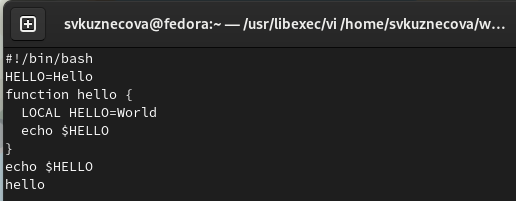

---
## Front matter
lang: ru-RU
title: Лабораторная работа №8
subtitle: Текстовой редактор vi
author:
  - Кузнецова С.В.
institute:
  - Российский университет дружбы народов, Москва, Россия
date: 16 марта 2023

## i18n babel
babel-lang: russian
babel-otherlangs: english

## Formatting pdf
toc: false
toc-title: Содержание
slide_level: 2
aspectratio: 169
section-titles: true
theme: metropolis
header-includes:
 - \metroset{progressbar=frametitle,sectionpage=progressbar,numbering=fraction}
 - '\makeatletter'
 - '\beamer@ignorenonframefalse'
 - '\makeatother'
---

# Информация

## Докладчик

:::::::::::::: {.columns align=center}
::: {.column width="70%"}

  * Кузнецова София Вадимовна
  * 16.03.2023
  * Студент прикладной информатики
  * Российский университет дружбы народов

:::
::: {.column width="30%"}

:::
::::::::::::::

# Цель

Познакомиться с операционной системой Linux. Получить практические навыки работы с редактором vi, установленным по умолчанию практически во всех дистрибутивах.

# Выполнение лабораторной работы

## Создание новых каталогов и вызов vi

vi hello.sh. (команда для вызова и создания файла)

{#fig:001 width=70%}

## Работа в vi

"i" - добавление иди изменение текста

{#fig:002 width=70%}

## Работа vi

"Esc" -  для перехода в командный режим.
":" - для перехода в режим последней строки.
"w" -(запись) и "q"(выйти).
"Enter" - для сохранения.

{#fig:003 width=70%}

## Исполняемый файл и его вызов на редактирование

Сделаем файл исполняемым и совершим вызов этого файла на редактирование.

{#fig:004 width=70%}

## Замена слова

Установим курсор в конец слова HELL второй строки и перейдём в режим вставки и заменим на HELLO. Нажмите "Esc" для возврата в командный режим.

{#fig:005 width=70%}

## Удаление слова и добавление нового

Теперь установим курсор на четвертую строку и сотрите слово LOCAL. Перейдём в режим вставки "i" и наберём local, нажмём "Esc" для возврата в командный режим.

{#fig:006 width=70%}

## Добавление новой строки

Установим курсор на последнюю строку и вставим после неё строку, содержащую следующий текст: echo $HELLO.

{#fig:007 width=70%}

## Удаление всей строки

"d" - двойное нажатие для удаления всей строки.

{#fig:008 width=70%}

## Отмена последней команды

"u" - для отмены последней команды.

{#fig:009 width=70%}

# Вывод

Познакомилась с операционной системой Linux. Получила практические навыки работы с редактором vi, установленным по умолчанию практически во всех дистрибутивах.
